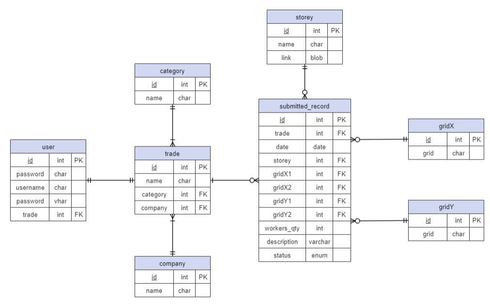

# PHP-MySQL-web-application
Web application for submission for site progress of construction project. Click [here](http://www.eprogress.site) to access the webiste.

## Features
- Allow subcontractor submitting their site work progress 
- Administrator have the right to approve or reject submitted site work progress
- Users can check their submitted record
- filter record by storey and submission status

## Login Accounts
<table>
<thead>
<tr>
<th>Username</th>
<th>Password</th>
<th>Role</th>
</tr>
</thead>
<tbody>
<tr>
<td>admin123</td>
<td>321admin</td>
<td>Administrator</td>
</tr>
</tbody>
</table>

## Database Schema

